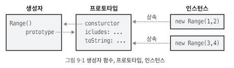

프로퍼티 = 변수 = 요소(element)  
클래스  
객체 =? 인스턴스  


# 클래스
클래스란 여러 타입의 변수들의 집합이며, 객체의 특성에 맞는 작업인 메소드를 정의한 것.  
쉽게 말해 복사가 가능한 틀이다.  

클래스의 인스턴스는 자신의 상태를 정의하는 자체 프로퍼티도 갖지만, 자신의 동작을 정의하는 메서드도 가진다.  
이런 메서드는 클래스에서 정의하며 모든 인스턴스에서 공유한다.

자바스크립트 클래스는 프로토타입 기반 상속을 사용한다.  

두 객체가 같은 프로토타입에서 프로퍼티(일반적으로 함수 값인 프로퍼티나 메서드)를 상속한다면 이들은 같은 클래스의 인스턴스라고 부른다.

기존방법과 class 키워드는 같은 방법으로 동작한다.

'고전적' 클래스의 특징을 상당 부분 자바스크립트에서 흉내 낼 수도 있지만, 자바스크립트 클래스의 프로토타입 기반 상속 매커니즘이 자바나 그 비슷한 언어의 클래스 기반 상속 메커니즘과 상당히 다르다는 점을 이해해야 한다.

## 9.1 클래스와 프로토타입
자바스크립트에서 클래스는 같은 프로토타입 객체에서 프로퍼티를 상속하는 객체 집합이다.  
따라서 프로토타입 객체가 클래스의 핵심 기능이다.

프로토타입 객체로부터 프로퍼티를 상속하는 객체를 생성해 반환하는 Object.create() 함수  
프로토타입 객체를 정의하고 Object.create()로 프로토타입을 상속하는 객체를 생성한다면 자바스크립트 클래스를 정의한 겁니다.

보통 클래스 인스턴스는 초기화가 더 필요하므로 새 객체를 생성하고 초기화하는 함수를 정의하는 것이 일반적이다.

- 예제 9-1
``` javaScript 
// Range 객체를 반환하는 팩토리 함수입니다.
function range(from, to) {
    // Object.create()를 써서 아래에서 정의하는 프로토타입 객체를 상속하는 객체를 생성합니다.
    // 프로토타입 객체는 이 함수의 프로퍼티로 저장되며 Range 객체에서 공유하는 메서드(동작)를 정의합니다.
    let r = Object.create(range.methods);

    // Range 객체의 시작점과 끝점(상태)을 저장합니다.
    // 이들은 이 객체에 고유한 프로퍼티이며 상속되지 않습니다.
    r.from = from;
    r.to = to;

    // 마지막으로 새 객체를 반환합니다.
    return r;
}

// 이 프로토타입 객체는 Range 객체가 상속하는 메서드를 정의합니다.
range.methods = {
    includes(x) { return this.from <= x && x <= this.to; },
    *[Symbol.iterator]() {
        for (let x = Math.ceil(this.from); x <= this.to; x++) yield x;
    },
    toString() { return "(" + this.from + "..." + this.to + ")"; }
};

// Range 객체의 사용 예제입니다.
let r = range(1, 3); // Range 객체를 생성합니다.
r.includes(2) // => true: 2는 범위 안에 있습니다.
r.toString() // => "(1...3)"
[...r] // => [1, 2, 3]; 이터레이터를 통해 배열로 변환합니다.
```

## 9.2 클래스와 생성자
예제 9-1은 자바스크립트 클래스를 정의하는 단순한 방법이다.  
하지만 생성자를 정의하지 않았기에 널리 쓰이는 방법은 아니다.  
생성자는 새로 생성된 객체를 초기화하도록 설계된 함수이다.  
생성자는 new 키워드를 사용해 호출한다.  
new를 사용해 생성자를 호출하면 자동으로 새 객체가 생성되므로, 생성자 자체에서 할 일은 새 객체의 상태를 초기화하는 것뿐이다.  

- 예제 9-2
``` javascript
// Range 객체를 초기화하는 생성자 함수입니다.
// 이 함수는 객체를 생성하거나 반환하지 않습니다. 그저 초기화할 뿐입니다.
function Range(from, to) {
    // Range 객체의 시작점과 끝점(상태)을 저장합니다.
    // 이들은 이 객체에 고유한 프로퍼티이며 상속되지 않습니다.
    this.from = from;
    this.to = to;
}

// Range 객체는 모두 이 객체를 상속합니다.
// 코드가 동작하기 위해서는 프로퍼티 이름이 반드시 prototype이어야 합니다.
Range.prototype = {
    includes: function (x) { return this.from <= x && x <= this.to; },

    [Symbol.iterator]: function* () {
        for (let x = Math.ceil(this.from); x <= this.to; x++) yield x;
    },

    toString: function () { return "(" + this.from + "..." + this.to + ")"; }
};

// Range 클래스는 다음과 같이 사용합니다.
let r = new Range(1, 3); // Range 객체를 만듭니다. new를 쓰는 것을 잊지 마십시오.
r.includes(2) // => true: 2는 범위 안에 있습니다.
r.toString() // => "(1...3)"
[...r] // => [1, 2, 3]; 이터레이터를 통해 배열로 변환합니다
```

화살표 함수는 호출한 객체가 아니라 자신이 정의된 컨텍스트에서 this 키워드를 상속한다.  
메서드는 자신을 호출한 인스턴스를 this로 참조할 수 있다는 것이 특징이므로 메서드에 화살표 함수를 사용하는 것은 무의미하다.  

### 9.2.1 생성자, 클래스의 본질, instanceof
클래스의 상속 여부를 확인

프로토타입 객체는 클래스의 본질임.  
두 객체가 같은 프로토타입 객체를 상속하지 않는다면 같은 클래스의 인스턴스가 아님.  

그러나 생성자 함수는 다르다.  
서로 다른 생성자 함수의 prototype 프로퍼티가 같은 프로토타입 객체를 참조할 수도 있음.  
그리고 두 생성자가 같은 클래스의 인스턴스를 초기화할 수 있다.  
``` javascript
r instanceof Range // true: r은 Range.prototype을 상속함.
```

r이 Range.prototype을 상속하는지만 판단함.  
Range.prototype을 상속하는 개체를 상속해도 true값을 반환.  

Range 생성자 함수로 생성한 것을 판단하는것이 아닌 Range.prototype을 상속하는지 판단함.  
``` javascript
function Strange() {}
Strange.prototype = Range.prototype;
new Strange() instanceof Range // => true
```

- isPrototypeOf()  
생성자 함수를 기준으로 하는것은 프로토타입 객체가 수정이 있었을시 정확성이 떨어짐  
해당 프로토타입의 객체인지 확인하고 싶을 땐 이 메서드를 사용하는것이 정확함.
``` javascript
range.methods.isPrototypeOf(r); // range.methods는 프로토타입 객체입니다.
```
예제 9-1 처럼 생성자 함수 없이 만든 객체에서 또한 사용이 가능하다.

### 9.2.2 생성자 프로퍼티
일반적인 자바스크립트 함수는 모두 생성자로 사용될 수 있고, 생성자를 호출할 때는 prototype 프로퍼티가 필요하다.  
따라서 일반적인 자바스크립트 함수는 모두 자동으로 prototype 프로퍼티를 갖는다.
이 프로퍼티의 값은 열거 불거인 constructor 프로퍼티 단 하나이고 값은 함수 객체이다.

``` javascript
let F = function() {}; // 함수 객체입니다.
let p = F.prototype; // F에 연결된 프로토타입 객체입니다.
let c = p.constructor; // 프로토타입에 연결된 함수입니다.
c === F // => true: 모든 F에 대해 F.prototype.constructor === F
```

constructor 프로퍼티를 가진 미리 정의된 프로토타입 객체가 존재한다는 것은, 그 객체가 일반적으로 자신의 생성자를 참조하는 constructor 프로퍼티를 상속한다는 의미이다.  

  
예제 9-2의 Range 클래스에서는 미리 정의된 Range.prototype 객체를 이용하여 덮어 썻었다.  
그래서 Range 클래스에는 constructor 프로퍼티가 없다.  
프로토타입에 생성자를 명시적으로 추가해서 이 문제를 해결할 수 있다.  

``` javascript
Range.prototype = {
 constructor: Range, // 생성자 역참조를 직접 만듭니다.
 // 메서드 정의
};
```

오래된 자바스크립트 코드에서는 constructor 프로퍼티를 덮어 쓰지 않게 한번에 하나씩 메서드를 추가하는 기법을 사용하기도 했다.

``` javascript
// 미리 정의된 Range.prototype 객체를 확장해서 자동으로 생성된
// Range.prototype.constructor 프로퍼티를 덮어 쓰지 않게 합니다.
Range.prototype.includes = function(x) {
 return this.from <= x && x <= this.to;
};
Range.prototype.toString = function() {
 return "(" + this.from + "..." + this.to + ")";
};
```

## 9.3 class 키워드를 사용하는 클래스
자바스크립트는 최초 버전부터 클래스를 지원했지만 ES6에서 class 키워드를 도입함.
예제 9-3은 Range 클래스를 새 문법으로 고쳐 쓴 버전임.

- 예제 9-3
``` javascript
class Range {
    constructor(from, to) {
        // Range 객체의 시작점과 끝점(상태)을 저장합니다.
        // 이들은 이 객체에 고유한 프로퍼티이며 상속되지 않습니다.
        this.from = from;
        this.to = to;
    }

    includes(x) { return this.from <= x && x <= this.to; }

    *[Symbol.iterator]() {
        for (let x = Math.ceil(this.from); x <= this.to; x++) yield x;
    }

    toString() { return `(${this.from}...${this.to})`; }
}

// Range 클래스는 다음과 같이 사용합니다.
let r = new Range(1, 3); // Range 객체를 생성합니다.
r.includes(2) // => true: 2는 범위 안에 있습니다.
r.toString() // => "(1...3)"
[...r] // => [1, 2, 3]; 이터레이터를 통해 배열로 변환합니다.
```
예제 9-2와 9-3에서 정의한 클래스가 정확히 같은 방법으로 동작한다는 점을 이해하는게 중요하다.  
class 키워드를 도입했지만 자바스크립트의 프로토타입 기반 클래스의 본질은 바뀌지 않았다.

예제 9-3에서 class 키워드를 사용하긴 하지만, 반환되는 Range 객체는 예제 9-2에서 정의한 버전과 마찬가지로 생성자 함수이다.  
새로운 class 문법은 명확하고 편리하긴 하지만 예제 9-2에서 설명한 더 기본적인 클래스 정의 메커니즘을 직관적으로 보여 줄 뿐이다.

다른 클래스를 상속하는 서브클래스를 정의할 때는 class 키워드와 함께 extends 키워드를 사용한다.
``` javascript
// Span은 Range와 비슷하지만 from과 to가 아니라 start와 length로 초기화됩니다.
class Span extends Range {
    constructor(start, length) {
        if (length >= 0) {
            super(start, start + length);
        } else {
            super(start + length, start);
        }
    }
}
```
* * *
``` javascript
let square = function(x) { return x * x; };
square(3) // => 9
```
위의 함수 표현식과 마찬가지로 클래스도 표현식 형태로 선언할 수 있다.
``` javascript
let Square = class { constructor(x) { this.area = x * x; } };
new Square(3).area // => 9
```

class 문법에서 알아야 할 주요한 점 두 가지
- "use strict" 지시자가 없다 해도 class 선언의 바디는 모두 묵시적으로 스트릭트 모드로 동작한다.
- 함수 선언과 다르게 클래스 선언은 끌어올려지지 않는다. 이를 방지하기 위해 클래스 선언 코드는 위에 작성해야 한다.

### 9.3.1 정적 메서드
클래스 바디의 메서드 선언 앞에 static 키워드를 붙여 정적 메서드를 정의할 수 있다.
정적 메서드는 프로토타입 객체의 프로퍼티가 아니라 생성자 함수의 프로퍼티로 정의된다.
``` javascript
static parse(s) {
    let matches = s.match(/^\((\d+)\.\.\.(\d+)\)$/);
    if (!matches) {
        throw new TypeError(`Cannot parse Range from "${s}".`)
    }
    return new Range(parseInt(matches[1]), parseInt(matches[2]));
}
```
이 코드가 정의하는 메서드는 Range.prototype.parse()가 아니라 Range.parse()이므로 인스턴스를 통해서는 호출할 수 없고 반드시 생성자를 통해 호출해야 한다.  
``` javascript
let r = Range.parse('(1...10)'); // 새 Range 객체를 반환합니다.
r.parse('(1...10)'); // TypeError: r.parse는 함수가 아닙니다.
```

정적 메서드는 클래스/생성자의 이름을 써서 호출하기 때문에 클래스 메서드라고 부른다.  
이는 클래스 인스턴스에서 호출하는 일반적인 인스턴스 메서드와 구별하기 위해서이다.  
정적 메서드는 인스턴스가 아니라 생성자에서 호출하기 때문에 정적 메서드에서 this 키워드를 사용하는 경우는 거의 없다.

### 9.3.3 공개, 비공개, 정적 필드
#### 공개 필드
다음과 같이 세 가지 필드를 초기화하는 생성자를 써서 클래스를 만든다고 한다.
``` javascript
class Buffer {
    constructor() {
        this.size = 0;
        this.capacity = 4096;
        this.buffer = new Uint8Array(this.capacity);
    }
}
```

새로운 인스턴스 필드 문법을 쓰면 위 코드를 다음과 같이 고쳐 쓸 수 있다.
``` javascript
class Buffer {
    size = 0;
    capacity = 4096;
    buffer = new Uint8Array(this.capacity);
}
```

필드 초기화 코드를 생성자에서 꺼내 클래스 바디에 직접 포함했다.  

이 코드는 생성자의 일부분으로 실행된다.  
생성자를 정의하지 않으면 필드는 묵시적으로 생성된 생성자의 일부분을 초기화된다.  

표현식 왼쪽에 붙였던 this.가 사라졌지만 이 필드를 참조하기 위해 반드시 this를 사용해야 하는 것은 마찬가지이며, 초기화 표현식 할당의 오른쪽에도 this를 사용해야 한다.  

- 초기화 표현식 없이 필드 이름 뒤에 세미콜론만 써서 선언할 수도 있다. 이렇게 선언하면 필드의 초깃값은 undefined이다.  
하지만 클래스 필드에는 항상 명시적인 초깃값을 쓰는 것이 더 좋다.  

#### 비공개 필드
비공개 인스턴스 필드 선언은 필드의 이름 앞에 #를 붙인다.  
비공개 필드는 클래스 바디 안에서는 사용할 수 있지만 클래스 바디 외부에서는 볼수 없고 접근할 수도 없으므로 자연스럽게 불변이 된다.  
해당 클래스의 필드를 비공개로 교체하고 게터 함수를 추가하여 읽기 전용으로 만들 수 있다.

``` javascript
class Buffer {
    #size = 0;
    get size() { return this.#size; }
}
```

비공개 필드는 반드시 새로운 필드 문법으로 선언해야만 사용할 수 있다.  
클래스 바디 안에서 명시적으로 선언하지 않으면 생성자에서 this.#size = 0 같은 코드를 사용할 수 없다.

#### 정적 필드
공개 필드나 비공개 필드 선언 앞에 static을 추가하면 그 필드는 인스턴스 프로퍼티가 아니라 생성자 함수의 프로퍼티로 생성된다.  
이미 정의한 정적 Range.parse() 메서드를 보자, 이 메서드에는 아주 복잡한 정규 표현식이 들어 있으므로 정적 필드로 분리하는 편이 낫다.  
제안된 새로운 정적 필드 문법을 사용하면 다음과 같이 고쳐 쓸 수 있다.

``` javascript
static integerRangePattern = /^\((\d+)\.\.\.(\d+)\)$/;
static parse(s) {
    let matches = s.match(Range.integerRangePattern);
    if (!matches) {
        throw new TypeError(`Cannot parse Range from "${s}".`)
    }
    return new Range(parseInt(matches[1]), matches[2]);
}
```

## 9.4 기존 클래스에 메서드 추가
자바스크립트의 프로토타입 기반 상속 메커니즘은 동적이다.  
객체는 자신의 프로토타입에서 프로퍼티를 상속하며, 설령 객체를 생성한 후에 프로토타입의 프로퍼티가 바뀌더라도 상속 관계는 끊어지지 않는다.  
따라서 프로토타입 객체에 새 메서드를 추가하는 것만으로 자바스크립트 클래스를 확장할 수 있다.

예제 9-4의 Complex 클래스에 켤레 복소수를 계산하는 메서드를 추가한다.
``` javascript
// 자신의 켤레 복소수를 반환합니다.
Complex.prototype.conj = function() { return new Complex(this.r, -this.i); };
```

자바스크립트에 내장된 클래스의 프로토타입 객체에도 이와 같은 일을 할 수 있다.  
즉, 숫자와 문자열, 배열, 함수 등에 메서드를 추가할 수 있다는 뜻이다.  
이는 오래된 브라우저에서 자바스크립트의 새로운 기능을 사용해야 할 때 활용 가능하다.
``` javascript
// 문자열 메서드 startsWith()가 존재하지 않는다면
if (!String.prototype.startsWith) {
    // indexOf() 메서드를 사용해 정의합니다.
    String.prototype.startsWith = function (s) {
        return this.indexOf(s) === 0;
    };
}
```

``` javascript
// 함수 f를 여러 번 반복합니다.
// 예를 들어 "hello"를 3번 출력하려면 이렇게 사용합니다.
// let n = 3;
// n.times(i => { console.log(`hello ${i}`); });
Number.prototype.times = function (f, context) {
    let n = this.valueOf();
    for (let i = 0; i < n; i++) f.call(context, i);
};
```

나중에 자바스크립트 새 버전에서 같은 이름의 메서드를 정의할 경우 혼란을 주거나 호환성 문제를 야기할 수 있으므로, 이렇게 내장 타입의 프로토타입에 메서드를 추가하는 건 일반적으로 좋은 방법이 아니다.
Object.prototype에 메서드를 추가해 어떤 객체에서든 사용할 수 있게 하는 것도 가능은 하지만, 절대 좋은 방법은 아니다.  
Object.prototype에 추가한 프로퍼티는 for/in 루프에서 열거되기 때문이다.

## 9.5 서브클래스
클래스 A를 상속받는 클래스 B가 있다.  
여기서 A는 슈퍼클래스, B는 서브클래스라고 한다.  
B의 인스턴스는 A의 메서드를 상속한다.  
클래스 B는 자신만의 메서드를 정의할 수 있고, 이 중 일부는 클래스 A에 있는 같은 이름의 메서드를 덮어 쓸 수 있다.  
B의 메서드가 A의 메서드를 덮어 쓰는경우 B에 존재하는 덮어 쓰는 메서드가 A에 존재하는 덮어 쓰인 메서드를 호출해야 할 때가 많다.  
마찬가지로 서브클래스 생성자 B()는 일반적으로 슈퍼클래스 생성자 A()를 호출해 그 인스턴스가 완전히 초기화됐는지 확인한다.  

### 9.5.1 서브클래스와 프로토타입
Range 클래스의 서브클래스인 Span을 만든다고 할 경우
이 서브클래스는 일반적인 Range처럼 동작하지만, from과 to로 초기화하지 않고 start와 span으로 초기화한다.  
Span클래스의 인스턴스는 Range 슈퍼클래스의 인스턴스 이기도 하다.  
Span 인스턴스는 Span.prototype에서 커스터마이징한 toString() 메서드를 상속하지만, Range의 서브클래스이기도 하므로 Range.prototype에서 inclueds() 같은 메서드도 상속한다.

``` javascript
// 서브클래스에서 사용할 생성자 함수입니다.
function Span(start, span) {
    if (span >= 0) {
        this.from = start;
        this.to = start + span;
    } else {
        this.to = start;
        this.from = start + span;
    }
}

// Span 프로토타입은 Range 프로토타입을 상속합니다.
Span.prototype = Object.create(Range.prototype);

// Range.prototype.constructor는 상속하지 않으므로 생성자 프로퍼티는 따로 정의합니다.
Span.prototype.constructor = Span;

// Span은 toString() 메서드를 따로 정의하므로 Range의 toString()을 상속하지 않고
// 덮어 씁니다.
Span.prototype.toString = function () {
    return `(${this.from}... +${this.to - this.from})`;
};
```
서브클래스 매커니즘을 빈틈없이 만들기 위해서는 클래스에서 슈퍼클래스의 생성자와 메서드를 호출할 수 있게 허용해야 하는데 이 상속 방식에서는 단순하게 처리할 방법이 없다.

### 9.5.2 extends와 super를 사용하는 서브클래스
ES6 이후의 클래스 선언에 extends 절을 추가하기만 해도 서브클래스를 만들 수 있다.  
자바스크립트 내장 클래스 또한 상속이 가능함.


``` javascript
// 첫 번째와 마지막 요소에 게터를 추가하는 서브클래스
class EZArray extends Array {
    get first() { return this[0]; }
    get last() { return this[this.length - 1]; }
}
let a = new EZArray();
a instanceof EZArray // => true: a는 서브클래스의 인스턴스입니다.
a instanceof Array // => true: a는 동시에 슈퍼클래스의 인스턴스입니다.
a.push(1, 2, 3, 4); // a.length == 4; 상속된 메서드를 사용할 수 있습니다.
a.pop() // => 4: 역시 상속된 메서드입니다.
a.first // => 1: 서브클래스에서 정의한 첫 번째 요소 게터입니다.
a.last // => 3: 서브클래스에서 정의한 마지막 요소 게터입니다.
a[1] // => 2: 일반적인 배열 접근 문법도 동작합니다.
Array.isArray(a) // => true: 서브클래스 인스턴스도 배열입니다.
EZArray.isArray(a) // => true: 서브클래스는 정적 메서드 역시 상속합니다.
```

인스턴스 메서드 뿐만 아닌 정적 메서드도 상속된다.


EZArray()는 Array()를 상속하는 함수다.
``` javascript
// EZArray.prototype이 Array.prototype을 상속하므로 인스턴스 메서드를 상속합니다.
Array.prototype.isPrototypeOf(EZArray.prototype) // => true

// EZArray가 Array를 상속하므로 EZArray는 배열의 정적 메서드와 프로퍼티 역시 상속합니다.
// 이것은 ES5 이전에는 불가능했던 extends 키워드의 기능입니다.
Array.isPrototypeOf(EZArray) // => true
```

``` javascript
class TypedMap extends Map {
    constructor(keyType, valueType, entries) {
        // entries가 지정됐으면 타입을 체크합니다.
        if (entries) {
            for (let [k, v] of entries) {
                if (typeof k !== keyType || typeof v !== valueType) {
                    throw new TypeError(`Wrong type for entry [${k}, ${v}]`);
                }
            }
        }
        // 타입을 체크한 entries로 슈퍼클래스를 초기화합니다.
        super(entries);
        // 타입을 저장하면서 서브클래스를 초기화합니다.
        this.keyType = keyType;
        this.valueType = valueType;
    }
    // 맵에 추가되는 새 항목마다 타입을 체크하도록 set() 메서드를 재정의합니다.
    set(key, value) {
        // 키나 값이 지정된 타입이 아니라면 에러를 일으킵니다.
        if (this.keyType && typeof key !== this.keyType) {
            throw new TypeError(`${key} is not of type ${this.keyType}`);
        }
        if (this.valueType && typeof value !== this.valueType) {
            throw new TypeError(`${value} is not of type ${this.valueType}`);
        }
        // 타입이 정확하면 슈퍼클래스의 set() 메서드를 호출해서 맵에 항목을 추가합니다.
        // 그리고 슈퍼클래스 메서드가 반환하는 것을 그대로 반환합니다.
        return super.set(key, value);
    }
}
```

- 서브클래스의 생성자를 정의하지 않으면 자동으로 생성된다.  
이렇게 묵시적으로 정의된 생성자는 전달된 값을 그대로 super()에 전달된다.
- super()를 써서 슈퍼클래스 생성자를 호출하기 전에는 생성자 안에서 this키워드를 사용하지 말아야 한다.

오버라이드
super.set()으로 슈퍼클래스의 set() 메서드를 불러올 수 있다.
생성자의 경우 this를 사용하기 전 super()로 슈퍼클래스 생성자를 호출해야 하지만 메서드의 경우는 그러할 필요가 없다.
덮어 쓰는 메서드의 어디서든 suepr를 사용해 슈퍼 클래스의 메서드를 호출할 수 있다.

### 9.5.3 위임과 상속
``` javascript
/**
 * 세트와 비슷하지만 추가되는 값마다 몇 번 추가됐는지 추적하는 클래스입니다.
 * 세트와 마찬가지로 add()와 remove() 메서드가 있고,
 * count() 메서드는 주어진 값이 몇 번 추가됐는지 반환합니다.
 * 기본 이터레이터는 최소 한 번 이상 추가된 값을 전달(yield)합니다.
 * [value, count] 쌍을 순회할 때는 entries()를 사용합니다.
 */
class Histogram {
    // 위임할 Map 객체를 만듭니다.
    constructor() { this.map = new Map(); }
    
    // 키가 추가된 횟수는 맵에 존재하며, 맵에 없으면 0입니다.
    count(key) { return this.map.get(key) || 0; }
    
    // 세트 비슷한 메서드 has()는 count가 0이 아닌 값이면 true를 반환합니다.
    has(key) { return this.count(key) > 0; }
    
    // 히스토그램 크기는 맵에 있는 항목 수와 같습니다.
    get size() { return this.map.size; }
    
    // 키를 추가하면 맵에서 count를 증가시킵니다.
    add(key) { this.map.set(key, this.count(key) + 1); }
    
    // 키 삭제는 조금 더 복잡합니다. 맵의 count가 0일 때만 키를 삭제해야 합니다.
    delete(key) {
        let count = this.count(key);
        if (count === 1) {
            this.map.delete(key);
        } else if (count > 1) {
            this.map.set(key, count - 1);
        }
    }
    // Histogram을 순회하면 저장된 키만 반환합니다.
    [Symbol.iterator]() { return this.map.keys(); }
    
    // 나머지 이터레이터 메서드는 Map 객체에 위임합니다.
    keys() { return this.map.keys(); }
    values() { return this.map.values(); }
    entries() { return this.map.entries(); }
}
```

굳이 extends을 이용한 정식 상속으로 해결할 필요는 없다.  
인스턴스를 만들어 필요한 메서드를 사용하는 방법도 존재한다.  
이것을 위임이라 한다.  

### 9.5.4 클래스 계층 구조와 추상 클래스
추상(abstract) 클래스란 완전히 구현되지 않은 클래스를 의미  
추상 슈퍼클래스에서 정의하는 부분 구현을 서브클래스 전체가 상속하고 공유할 수 있다.  
서브클래스는 슈퍼클래스가 정의(define)한 (하지만 구현(implement)하지는 않은) 추상 메서드를 구현하여 자신만의 고유한 동작을 정의할 수 있다.

자바스크립트는 추상 메서드, 추상 클래스를 공식적으로 정의하지 않는다.